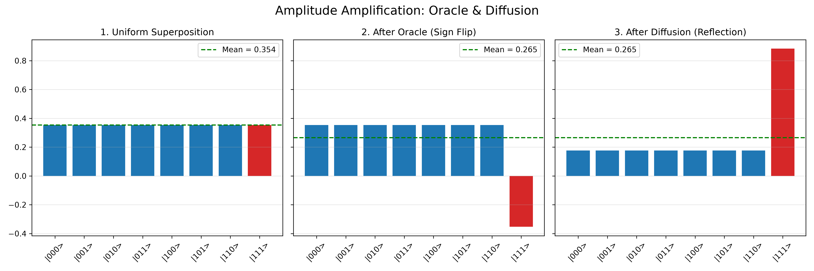
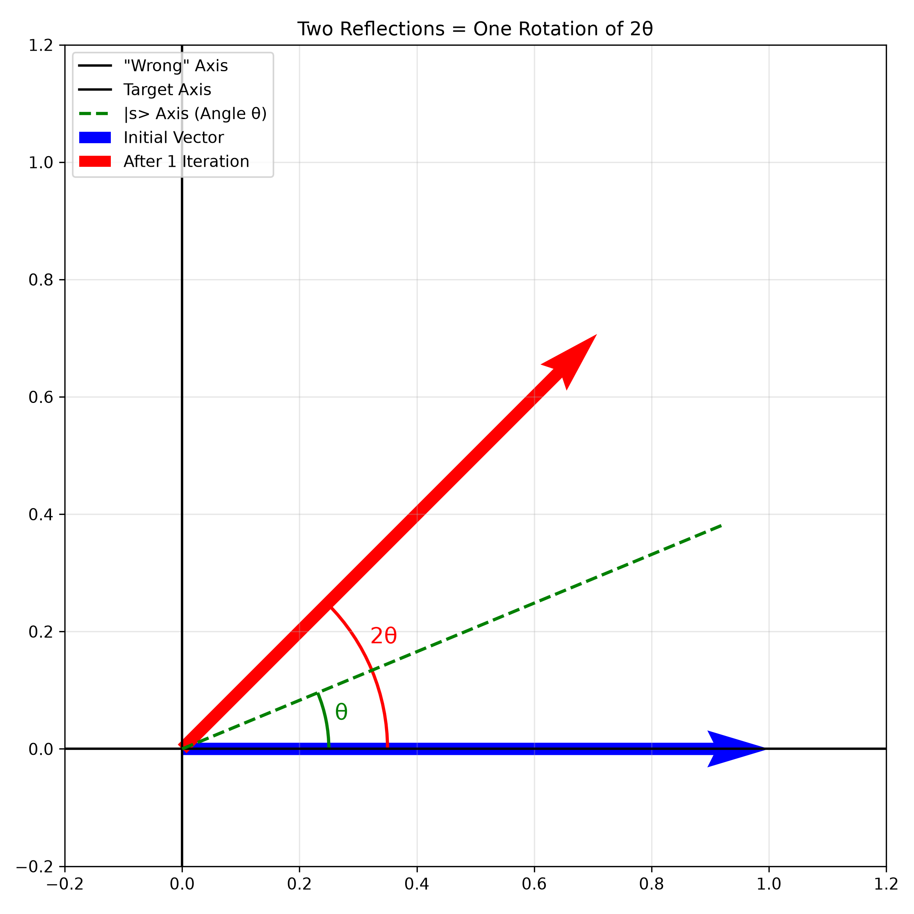
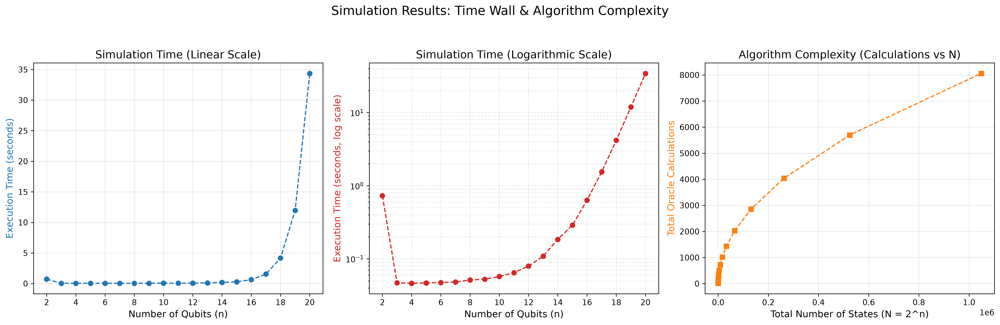
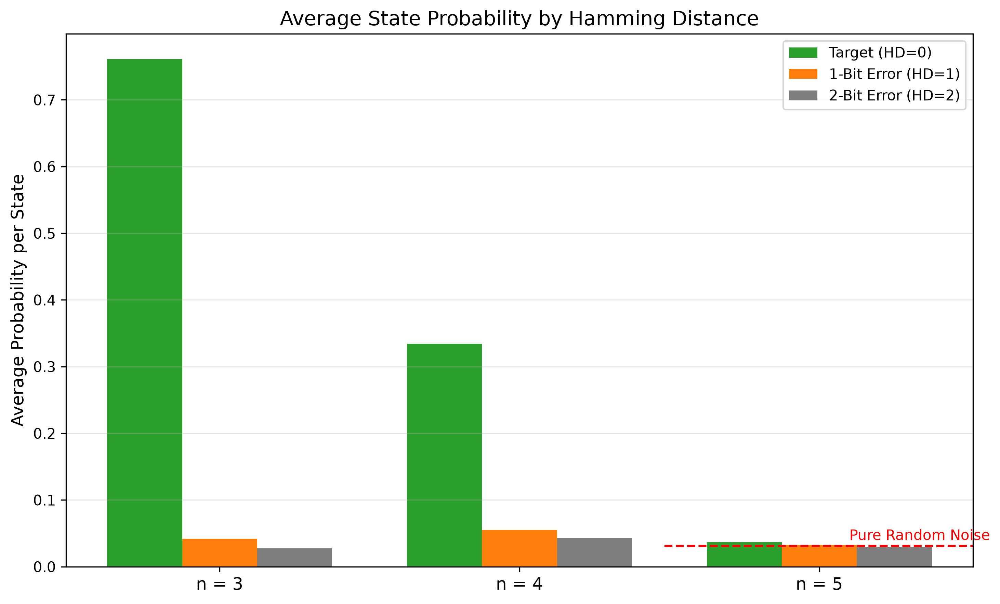
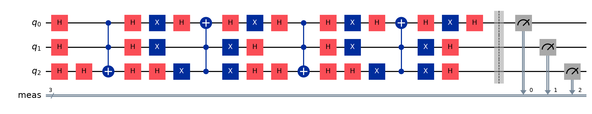
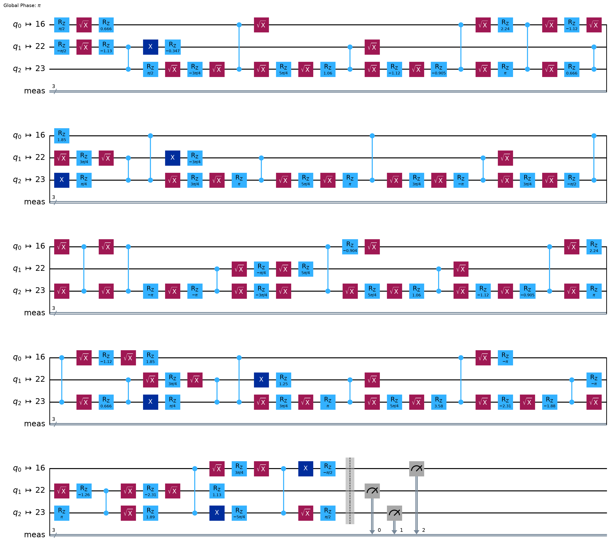

# A basic introduction to Grover's Algorithm

### Introduction

After encountering **Grover's algorithm** through the 3Blue1Brown channel, I found myself struggling to grasp exactly how it worked under the hood. For me, the best path to understanding is building and explaining it myself. 

My goal here is to deliver a basic but thorough explanation for developers who don't have a background in quantum physics, but are comfortable with basic linear algebra.

---

### Theory: Vectors Over Particles

It is best to release the urge to think about a qubit as a physical particle with mysterious properties. Instead, treat it simply as a **state vector**. When inspected (measured), this vector collapses into one of the basis vectors.
<br>

```math
|\psi\rangle = \alpha|0\rangle + \beta|1\rangle \quad \stackrel{\text{Measurement}}{\longrightarrow} \quad \begin{cases} |0\rangle \text{ with probability } |\alpha|^2 \\ |1\rangle \text{ with probability } |\beta|^2 \end{cases}
```

<br>

Like classical bits, an $n$-qubit system has $2^n$ possible states. Each possible state occupies its own row in the state vector in a predetermined order. 

<br>

```math
|\psi\rangle = \begin{pmatrix} \alpha \\ \beta \\ \gamma \\ \delta \end{pmatrix} = \alpha|00\rangle + \beta|01\rangle + \gamma|10\rangle + \delta|11\rangle
```

<br>

> **Born's Rule:** The number assigned to each state is its **probability amplitude**. If you take the absolute square of an amplitude, you get the actual probability of the system collapsing into that state. Because probabilities must add up to 100%, the **sum of all absolute squared amplitudes is strictly $1$**.

For a single qubit, $|0\rangle$ and $|1\rangle$ represent the standard basis vectors. A 2D quantum state is just a linear combination of these basis vectors, with the amplitudes serving as coefficients. A qubit with a state vector containing more than one non-zero amplitude is in **superposition**.
<br>

```math
|\psi\rangle = \begin{pmatrix} \alpha \\ \beta \end{pmatrix} = \alpha \begin{pmatrix} 1 \\ 0 \end{pmatrix} + \beta \begin{pmatrix} 0 \\ 1 \end{pmatrix} = \alpha|0\rangle + \beta|1\rangle
```
<br>

Because of quantum mechanics, you can never interact directly with the state vector to read its raw values. Measuring it forces a collapse. Therefore, to compute anything, you must manipulate the state vector blindly using **quantum gates**.

Do not think of a quantum gate as a physical object made from silicon transistors. Think of it as a **mathematical matrix** that multiplies and transforms your vector. For example, a quantum NOT gate (the Pauli-X gate) flips the amplitudes of $|0\rangle$ and $|1\rangle$.

* **Classical NOT Gate:** `NOT(0) = 1`  
* **Quantum NOT Gate (Pauli-X):**
<br>

```math
X = \begin{pmatrix} 0 & 1 \\ 1 & 0 \end{pmatrix} \quad \implies \quad \begin{pmatrix} 0 & 1 \\ 1 & 0 \end{pmatrix} \begin{pmatrix} \alpha \\ \beta \end{pmatrix} = \begin{pmatrix} \beta \\ \alpha \end{pmatrix}
```
<br>

It’s important to note that you cannot just invent any matrix and call it a gate. **Quantum gates are physically constrained** (they must be unitary). Quantum computers aren't universally faster than classical ones; they only excel in highly specific areas where clever algorithms exploit these limited matrix operations.

---

### Grover’s Algorithm

For simplicity, I will explain the core concepts using a small number of qubits, but this expands directly to larger systems. In reality, large matrices (like a NOT gate applied to 2 qubits simultaneously) are simply the **Kronecker product** of the basic $2 \times 2$ matrices that assemble them.
<br>

```math
X \otimes X = \begin{pmatrix} 0 & 1 \\ 1 & 0 \end{pmatrix} \otimes \begin{pmatrix} 0 & 1 \\ 1 & 0 \end{pmatrix} = \begin{pmatrix} 0 & 0 & 0 & 1 \\ 0 & 0 & 1 & 0 \\ 0 & 1 & 0 & 0 \\ 1 & 0 & 0 & 0 \end{pmatrix}
```
<br>

To start a quantum algorithm, we initialize the system in a "pure" state of all zeros, and immediately put it into a **uniform superposition** so every possible answer has an equal amplitude. For a system with $N$ states, every amplitude becomes $\frac{1}{\sqrt{N}}$. 

The gate that performs this is the **Hadamard (H) gate**:
<br>

```math
H = \frac{1}{\sqrt{2}} \begin{pmatrix} 1 & 1 \\ 1 & -1 \end{pmatrix} \quad \implies \quad H|0\rangle = \frac{1}{\sqrt{2}} \begin{pmatrix} 1 \\ 1 \end{pmatrix}
```
<br>

Grover’s algorithm relies on manipulating these amplitudes in **two repeating steps**:

1. **The Oracle:** We single out the answer we seek (the target) and flip its sign from positive to negative. Because all other states remain positive, this drops the target's amplitude far below the overall average.
2. **The Diffusion:** We reflect every state's amplitude around that new average. Since the target was artificially pushed far below the mean, bouncing it across the average causes it to shoot up, drastically increasing its size while shrinking everything else.

By repeating this Oracle-Diffusion cycle a calculated number of times ($\approx \frac{\pi}{4}\sqrt{N}$), we **continuously amplify the target's probability** until measuring the circuit is guaranteed to give us the right answer.



---

### The Oracle

In principle, every problem has its own specific Oracle. The goal is to create a quantum operation that **"spits out" a minus sign if the answer is correct**, and does nothing otherwise. Because quantum operations are strictly linear, if you pass a vector in superposition, the Oracle will only flip the specific component that aligns with the target.

In my implementation, I want my target to be the state of all ones, $|11\dots1\rangle$. Therefore, I need to flip only the amplitude of that specific state. If we look at the simplest setup of just one qubit (a 2D vector), it's like wanting to **flip only the y-axis component**.
<br>

```math
\begin{pmatrix} \alpha \\ \beta \end{pmatrix} \quad \stackrel{\text{Oracle}}{\longrightarrow} \quad \begin{pmatrix} \alpha \\ -\beta \end{pmatrix}
```
<br>

Those who remember their linear algebra well can already guess what that matrix looks like:
<br>

```math
Z = \begin{pmatrix} 1 & 0 \\ 0 & -1 \end{pmatrix}
```
<br>

For a single qubit, this operation is called the **Pauli-Z gate**. For multiple qubits, we need an **MCZ (Multi-Controlled Z)** gate, which phase-flips only the $|11\dots1\rangle$ state in the state vector (the very last amplitude).

The catch is that while Qiskit has a basic Z gate, **there is no native MCZ gate in the basic physical hardware set**. We have to build a workaround using the **MCX (Multi-Controlled X) gate**. The MCX takes a group of "control" qubits and one "target" qubit. If the control group is all ones, it flips the target. (For a single qubit setup, the MCX is just a standard NOT gate).

This is the foundation we’ll build upon. We want to manipulate a vector using a matrix such that if the vector is on the span of $\vec{v}$, the output is $-\vec{v}$. But if it’s orthogonal to $\vec{v}$, it remains unchanged. In matrix notation:
<br>

```math
Z \begin{pmatrix} x \\ y \end{pmatrix} = \begin{pmatrix} x \\ -y \end{pmatrix}
```
<br>

**Changing the Basis**

To achieve this using the X gate, I’ll introduce two common basis vectors used in quantum algorithms: $|+\rangle$ and $|-\rangle$.
<br>

```math
|+\rangle = \frac{1}{\sqrt{2}} \begin{pmatrix} 1 \\ 1 \end{pmatrix}, \quad |-\rangle = \frac{1}{\sqrt{2}} \begin{pmatrix} 1 \\ -1 \end{pmatrix}
```
<br>

Notice what happens if we pass them through a NOT (X) gate:
<br>

```math
X|+\rangle = |+\rangle
```
<br>

```math
X|-\rangle = -|-\rangle
```

<br>

These two vectors are orthonormal to each other, meaning they **form a valid basis**. If we want an operation that phase-flips only $|1\rangle$ and leaves $|0\rangle$ alone, we need to temporarily **change our basis** so that $|1\rangle$ lands on $|-\rangle$ and $|0\rangle$ lands on $|+\rangle$. We do exactly that with the Hadamard gate.

<br>

```math
H|0\rangle = |+\rangle
```
<br>

```math
H|1\rangle = |-\rangle
```

<br>
Because the Hadamard matrix is its own inverse, we can switch the basis back to the original simply by applying another Hadamard. In summary:

$H \to X \to H = Z$.

One way to prove this is through straightforward matrix multiplication:
<br>

```math
\frac{1}{\sqrt{2}} \begin{pmatrix} 1 & 1 \\ 1 & -1 \end{pmatrix} \begin{pmatrix} 0 & 1 \\ 1 & 0 \end{pmatrix} \frac{1}{\sqrt{2}} \begin{pmatrix} 1 & 1 \\ 1 & -1 \end{pmatrix} = \begin{pmatrix} 1 & 0 \\ 0 & -1 \end{pmatrix} = Z
```
<br>

In my opinion, a much more interesting approach is to acknowledge that the two **eigenvectors** of the NOT matrix are $|+\rangle$ and $|-\rangle$, with **eigenvalues** of $1$ and $-1$ respectively. The NOT matrix essentially flips the space around $|+\rangle$. If we rotate the space beforehand so that the unwanted answers land on $|+\rangle$, and then rotate it back afterwards, the entire operation leaves the unwanted answers completely unaffected while perfectly flipping the sign of our target.

---

### Scaling to Multiple Qubits

To bridge this into scenarios with more than 1 qubit, let's look at an $n$-qubit system. We’ll choose one qubit to be our target, and all the rest will be controls. The process is:

1. Apply **Hadamard** only on the target.
2. Apply **MCX** across all qubits (using the chosen target).
3. Apply **Hadamard** again only on the target.

Let's walk through what happens in each possible scenario:

* **A) Some controls are 0:** 
  The first H puts the target in a superposition. Because not all controls are 1, the MCX does absolutely nothing. The second H just cancels out the first H. **Net effect: zero change.**

* **B) Controls are 1, but target is 0:** 
  The first H transforms the target $|0\rangle$ into $|+\rangle$. The MCX activates, but since $|+\rangle$ is an eigenvector with an eigenvalue of 1, the MCX doesn't change it. The second H transforms it right back to $|0\rangle$.

* **C) Controls are 1, and target is 1:** 
  The first H transforms the target $|1\rangle$ into $|-\rangle$. The MCX activates. Since $|-\rangle$ is the eigenvector with an eigenvalue of -1, it flips the sign. The second H returns the target to $|1\rangle$, but that negative sign remains factored out in front of the entire state. **The output becomes:**
<br>

```math
|1\rangle \otimes |1\rangle \dots \otimes |1\rangle \otimes (-|1\rangle) = (-1) \left( |1\rangle \otimes |1\rangle \dots \otimes |1\rangle \right)
```
<br>

* **D) The entire system is in superposition:** 
  A superposition is just a linear combination of all possible outcomes. Because every quantum matrix operation ($U$) is **strictly linear**, our H-MCX-H block will act on each component exactly as described above, and then sum them back together. 
<br>

```math
U(\alpha|x\rangle + \beta|y\rangle) = \alpha U|x\rangle + \beta U|y\rangle
```
<br>

---

### The Diffusion

We know we want to reflect every amplitude around the **mean** of all amplitudes, but what does that actually "mean" in algebra? Let's say one specific amplitude is $x$, the overall mean is $m$, and the new reflected value of $x$ is $x^*$. 

Geometrically, the distance from $x$ to the mean must equal the distance from the mean to $x^*$:

<br>

```math
x - m = m - x^* \implies x^* = 2m - x
```
<br>

For example, if we have a vector:

```math
\begin{pmatrix} 3 \\ 1 \end{pmatrix}
```

<br>

the mean of its components is $2$ . By applying our formula to each axis, we get:

<br>

```math
\begin{pmatrix} 3 \\ 1 \end{pmatrix} \quad \stackrel{\text{Reflect around } 2}{\longrightarrow} \quad \begin{pmatrix} 1 \\ 3 \end{pmatrix}
```

<br>

If the mean happens to be exactly zero, the formula simply becomes $x^* = -x$, meaning we just **phase-flip every amplitude**. It’s also important to note that the mean itself never changes during this transformation.

But how do we find the mean mathematically? In a 2D plane, consider the line $y=x$. If we take any point $(a, b)$ in space and drop a perpendicular line onto that diagonal, the intersection point will be exactly $(\frac{a+b}{2}, \frac{a+b}{2})$. In linear algebra terms, you find the mean of a vector's amplitudes by **projecting it onto the main diagonal** (using a dot product). 

Therefore, a vector composed entirely of the mean will always lie on the diagonal subspace of the plane. Reflecting our state vector around the mean literally "means" reflecting it around a vector contained in the span of $(1, 1, 1 \dots 1)$. 

In quantum mechanics, the normalized vector representing this exact diagonal span is the **uniform superposition state**, often denoted as $|s\rangle$. We can easily create it by applying Hadamard gates to the zero state:

<br>

```math
|s\rangle = H^{\otimes n} |00\dots0\rangle = \frac{1}{\sqrt{N}} \begin{pmatrix} 1 \\ 1 \\ \vdots \\ 1 \end{pmatrix}
```

<br>

So, our goal is to reflect all the amplitudes around $|s\rangle$. But, as we learned from the Oracle process, there is no basic gate that magically does that. Instead, we have to build it using **three clever tricks**.

#### Trick 1: Rotate the Space

We can rotate the entire vector space such that the diagonal $|s\rangle$ lands perfectly on the first axis, $|00\dots0\rangle$. We do this by applying the trustworthy **Hadamard gate** to our state vector. 

#### Trick 2: The Global Phase Illusion

Now that our target reflection line is sitting on $|00\dots0\rangle$, it’s clear we want to reflect all the values around this first axis. Reflecting a vector around an axis is geometrically identical to **flipping the sign of every single component in the vector *except* the one on that axis**. 

<br>

```math
\begin{pmatrix} a \\ b \\ c \\ d \end{pmatrix} \quad \stackrel{\text{Reflect around 1st axis}}{\longrightarrow} \quad \begin{pmatrix} a \\ -b \\ -c \\ -d \end{pmatrix}
```

<br>

Here is the quantum catch: because physical probability is the absolute squared value of the amplitudes, a **global minus sign** doesn't change the physical state of the vector at all. Factoring out a negative sign proves that flipping every axis *except* the first one is mathematically and physically identical to flipping *only* the first axis!

<br>

```math
\begin{pmatrix} a \\ -b \\ -c \\ -d \end{pmatrix} = - \begin{pmatrix} -a \\ b \\ c \\ d \end{pmatrix} \equiv \begin{pmatrix} -a \\ b \\ c \\ d \end{pmatrix}
```

<br>

#### Trick 3: Reusing the Oracle Logic

We are now at a point where we know we just need to sign-flip the $|00\dots0\rangle$ axis. There’s no single quantum gate that does that. However, in the Oracle step, we already constructed an MCZ gate that flips the $|11\dots1\rangle$ axis (the very last one). 

So, to execute the final maneuver, we just need to:
1. Apply a **massive X (NOT) gate** to all qubits to shift $|00\dots0\rangle$ to $|11\dots1\rangle$.
2. Use the **Oracle's MCZ** ($H \to MCX \to H$) to flip the sign of that newly shifted axis.
3. Apply another **massive X gate** to shift it back to $|00\dots0\rangle$.
4. Use another **Hadamard gate** to rotate the vector space back to its original orientation.

The complete Diffusion step is a sandwich of logic gates:

<br>

```math
H \to X \to (H \to MCX \to H) \to X \to H
```

<br>

---

### A Note on the Physics and Hardware

One might ask: why use a Hadamard gate (which has a determinant of -1 and performs a reflection) just to rotate the vector space, instead of using a pure rotation gate like $R_y$ (which has a determinant of 1)? 

1. **The Global Phase Illusion:** As established earlier, a global minus sign does not affect the physical probability distribution. Geometrically reflecting the space is physically indistinguishable from purely rotating it.
2. **Self-Inverse Efficiency:** The Hadamard matrix is its own inverse ($H = H^{-1}$). Using it to enter and exit our basis changes makes the algorithm beautifully symmetrical and efficient to code ($H \to \dots \to H$).
3. **Hardware Translation:** While Hadamard is the definitive standard in quantum theory, it is actually not a "native" physical gate on systems like IBM Quantum. However, it is incredibly efficient for the transpiler to construct using just a few basic physical microwave pulses (like $R_z$ and $\sqrt{X}$), making it the optimal logical building block.

In fact, this exposes a much larger reality about physical hardware: **almost none of the gates in our textbook circuit physically exist**. Just as the Hadamard is translated into microwave pulses, the massive multi-controlled MCX gate is completely synthetic. When you send this code to an actual quantum computer, the transpiler breaks these logical gates down into a long, complex web of simple 1-qubit and 2-qubit native physical gates (such as `sx`, `rz`, and `cz`). I will show exactly what this physically compiled circuit looks like, and the decoherence it causes, in the hardware implementation section below.

---

### Runtime Complexity

The entire reason Grover's algorithm is famous is its superiority over classical random search, which requires $O(N)$ time. 

When measuring quantum algorithmic speed, we count the number of times we have to run the Oracle-Diffusion cycle (an **iteration**). The question is: how many iterations do we need to run before we are almost entirely sure that measuring the vector will show us the desirable answer? If we run them too few times, the target amplitude won't be high enough. If we run them too many times, the target amplitude will actually start decreasing as it rotates past the optimal point!

To understand the exact number of iterations required, we can reduce our massive $N$-dimensional space down to a simple flat 2D plane. 

Throughout the entire algorithm, our state vector only ever lives in a 2D plane defined by two axes:
1. **The Target Axis:** The correct answer we are looking for.
2. **The "Wrong" Axis:** The uniform superposition of all the incorrect answers combined.

When we initialize our system in the uniform state $|s\rangle$, the vector is incredibly close to the "Wrong" axis because there is only one right answer and millions of wrong ones. The starting angle $\theta$ between our vector and the "Wrong" axis is determined by the target's initial amplitude, which is $\frac{1}{\sqrt{N}}$.

Using basic trigonometry, the sine of this starting angle is:

<br>

```math
\sin(\theta) = \frac{1}{\sqrt{N}}
```

<br>

Because $N$ is usually a massive number, $\frac{1}{\sqrt{N}}$ is tiny. For very small angles, $\sin(\theta) \approx \theta$. Therefore, our starting angle is roughly $\theta \approx \frac{1}{\sqrt{N}}$ radians.

Now, let's look at what one full iteration (Oracle + Diffusion) actually does geometrically:
1. **The Oracle** reflects the vector across the "Wrong" axis.
2. **The Diffusion** reflects that new vector across the original $|s\rangle$ axis.

A fundamental rule in geometry states that performing two reflections across two intersecting axes results in a **pure rotation**. Specifically, the vector rotates by exactly twice the angle between the two axes. Since the angle between the "Wrong" axis and $|s\rangle$ is $\theta$, **every single Grover iteration rotates our vector by exactly $2\theta$** directly towards the Target axis.

Our goal is to rotate the vector from its starting position (almost flat on the "Wrong" axis) all the way up to the Target axis, which is exactly a $90^\circ$ rotation, or $\frac{\pi}{2}$ radians.

To find out how many steps it takes, we simply divide the total angular distance we need to travel by the angular distance we travel in each step:

<br>

```math
\text{Total Steps} = \frac{\text{Total Angle}}{\text{Angle per Step}} = \frac{\pi / 2}{2\theta} \approx \frac{\pi / 2}{2(1/\sqrt{N})} = \frac{\pi}{4}\sqrt{N}
```
<br>
<br>

<p align="center">
  
</p>


---

### Simulation vs. Real Hardware

You might wonder: if this entire process is just matrix multiplication, why can't we just write a classical Python script to do it? 

Even if we copy this process to classical cpu and rotate the space the correct amount of iterations, we're still left with a massive array of $N$ probability amplitudes. To actually figure out which state has the highest squared amplitude, we have to search through that entire array. Finding the max value in an array is an $O(N)$ operation. So, doing this classically completely defeats the purpose. 

In a real quantum computer, we don't have to search the array. We just measure the system. The wave collapses, and the highest-probability answer simply drops out.

**The Physical Hardware Tax**

On the other hand, there is a physical constraint we didn't adress. When computer scientists say Grover takes $O(\sqrt{N})$ time, they are refering the number of *Oracle iterations*. We've been treating the Oracle and Diffusion blocks like they happen in a single step. 

But as mentioned earlier, a real quantum gate only operates on one or two qubits at a time. The compiler breaks our massive MCX gates down into a long sequence of simpler physical gates. If $n$ is the number of qubits, constructing that MCX gate takes roughly $O(n)$ physical operations. 

Since the total number of states is $N = 2^n$, the physical time it takes to execute one iteration scales by $n$, which is $\log_2(N)$. So, if you measure the actual clock time the machine takes to run the algorithm, it’s not purely $O(\sqrt{N})$. It is technically:

```math
O(\log_2(N)\sqrt{N})
```

---

# Classical Simulation

In the accompanying code, I run the Oracle-Diffusion cycle on IBM’s Qiskit simulator, scaling from 2 up to 20 qubits. The script tracks both the physical execution time and the total number of theoretical calculations. This demonstrates exactly how the algorithm is supposed to scale mathematically, while exposing the physical limits of simulating quantum mechanics on a classical C++ backend. 

A few technical details about the benchmark graphs are worth highlighting:

1. **The Initialization Overhead:** You will notice that running a 2-qubit circuit takes significantly longer than 3 qubits, which seems physically backwards. This is a classic software quirk: during the very first run, Qiskit spends time loading libraries, compiling code, and allocating memory. I left this outlier in the data because it reflects real software behavior rather than abstract math.
2. **The System Overhead Plateau:** On the logarithmic scale, execution time barely changes between 3 and 7 qubits. Matrix multiplications of that scale take a modern CPU fractions of a microsecond. The ~47 milliseconds in that flatline is purely the overhead of Python and the operating system dispatching jobs. Only around 12–13 qubits do the matrices get large enough ($4096 \times 4096$) for the linear algebra to become the primary bottleneck.
3. **Visualizing $\sqrt{N}$ vs. $n$:** I plotted the calculation count against $N$ (Total States) rather than $n$ (qubits). If plotted against $n$, the curve would appear exponential because $O(\sqrt{2^n}) = O(1.41^n)$. Plotting against $N$ clearly displays the flattened curve characteristic of a square root function, visually demonstrating how Grover drastically undercuts classical $O(N)$ random search.

<br>

<p align="center">
  
</p>

<br>

The data highlights the practical "time wall" of classical simulation. Jumping from 50 milliseconds to 34 seconds simply by adding a few qubits demonstrates why simulating a 50-qubit system would take years on standard hardware. 

*(Note: The full benchmark data is available in `grover_benchmark.csv` for independent plotting and verification).*

---

# Physical Reality

After validating the algorithm in simulation, I submitted the circuits (for $n=3, 4,$ and $5$) to the IBM Quantum Platform to run on physical quantum processors. Each circuit was executed 1,000 times to observe the real-world probability distributions. 

The results show a couple of interesting facts:

1. **The Decoherence Cliff:** The gap between ideal math and physical reality is stark. For $n=3$, the hardware successfully identified the target state 76.1% of the time. At $n=4$, the success rate dropped to 33.4%. By $n=5$, the target state (`11111`) was measured only 3.7% of the time—barely above the 3.125% threshold of pure random noise. The system completely succumbed to decoherence before the calculation could finish.
2. **The Anatomy of Noise:** When the machine fails, it doesn't fail entirely randomly. As shown in the graphs, the most frequent incorrect answers are usually those with a Hamming Distance of 1 (states that differ from the correct answer by exactly one bit). This proves that hardware noise is largely a localized, physical phenomenon—individual qubits losing their energy state or flipping over time—rather than the math itself breaking down.

<br>
<p align="center">
  
</p>

<br>

### Transpiling

Below is the circuit diagram for $n=3$ qubits before and after transpilation. You can see that even in the logical phase, the multi-controlled $MCX$ gate doesn't really exist—it's mathematically constructed from Pauli-X and Hadamard gates. 

But after passing through Qiskit's transpiler, even those familiar gates dissolve. The physical IBM hardware only understands a native basis of microwave pulses: $R_z$, $X$, $SX$ (Square-root of X), and $CZ$. Translating our logic into these basic physical pulses causes the gate count to explode. This is the quantum equivalent of compiling high-level Python code down to machine assembly language.

<br>
<p align="center">
  
</p>
<br>

<p align="center">
  
</p>
<br>

### Why Target `|11...1>`? 

This massive hardware degradation highlights exactly why I chose a simple target state (`|11...1>`) for this benchmark. 

Targeting this specific state allows the Oracle to be built as a highly efficient $H - MCX - H$ sandwich. If we tried to search for a more complex, randomized state or solve a real world logic puzzle the Oracle would require far more gates to construct. That added circuit depth would cause the physical qubits to decohere much earlier. By keeping the Oracle as shallow as possible, we gave the hardware a chance to demonstrate Grover's amplitude amplification before the noise took over. Therefore, reinforcing the argument that QCs are still far from usable.
